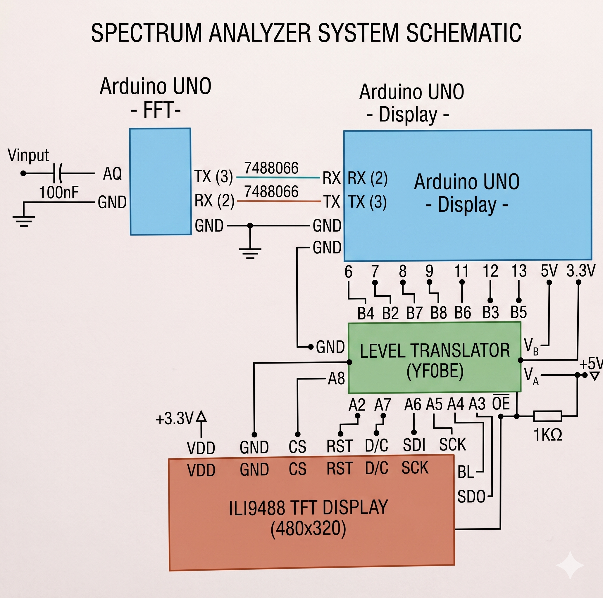

# UNO_FFT_ILI9488

Analyseur de spectre audio haute performance basé sur l'architecture double Arduino UNO.

## Description
Ce projet utilise deux Arduino UNO pour séparer les responsabilités :
- **UNO 1 (FFT) :** Acquisition du signal audio et calcul de la Transformée de Fourier Rapide.
- **UNO 2 (Display) :** Gestion de l'affichage sur écran TFT ILI9488.

## Schéma de câblage
Voici le schéma de connexion du système :

## Prérequis matériels
- 2x Arduino UNO
- 1x Écran TFT ILI9488 (480x320)
- 1x Level Translator (YFOBE)
- Composants passifs (Condensateur 100nF, Résistance 1KΩ)

## Bibliothèques requises
Pour compiler le code, assure-toi d'installer les bibliothèques suivantes via le gestionnaire Arduino :
- `arduinoFFT`
- `Adafruit_ILI9488`
- `Adafruit_GFX_Library`

## Licence
Ce projet est sous licence **Apache License 2.0**. Voir le fichier `LICENSE` pour plus de détails.
